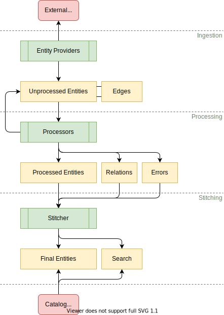
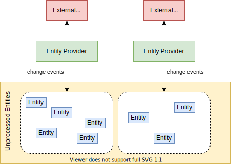
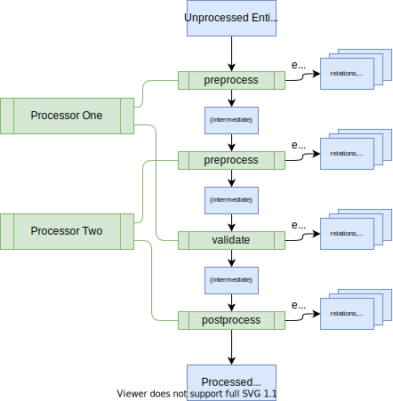
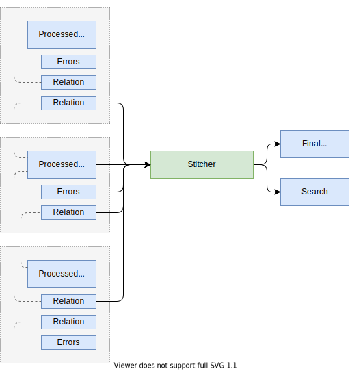

# 1-1 Core Features: software catalog
```
 _______  _______  _______  _______  _     _  _______  ______    _______        _______  _______  _______  _______  ___      _______  _______ 
|       ||       ||       ||       || | _ | ||   _   ||    _ |  |       |      |       ||   _   ||       ||   _   ||   |    |       ||       |
|  _____||   _   ||    ___||_     _|| || || ||  |_|  ||   | ||  |    ___|      |       ||  |_|  ||_     _||  |_|  ||   |    |   _   ||    ___|
| |_____ |  | |  ||   |___   |   |  |       ||       ||   |_||_ |   |___       |       ||       |  |   |  |       ||   |    |  | |  ||   | __ 
|_____  ||  |_|  ||    ___|  |   |  |       ||       ||    __  ||    ___|      |      _||       |  |   |  |       ||   |___ |  |_|  ||   ||  |
 _____| ||       ||   |      |   |  |   _   ||   _   ||   |  | ||   |___       |     |_ |   _   |  |   |  |   _   ||       ||       ||   |_| |
|_______||_______||___|      |___|  |__| |__||__| |__||___|  |_||_______|      |_______||__| |__|  |___|  |__| |__||_______||_______||_______|
```

## Index


## Overview
- The Backstage Software Catalog is a centralized system that keeps track of ownership and metadata for all the software in your ecosystem (services, websites, libraries, data pipelines, etc). The catalog is built around the concept of metadata YAML files stored together with the code, which are then harvested and visualized in Backstage.
- Software Catalog enables two main use-cases:
1. Helping teams manage and maintain the software they own. Teams get a uniform view of all their software; services, libraries, websites, ML models — you name it, Backstage knows all about it.
2. Makes all the software in your company, and who owns it, discoverable. No more orphan software hiding in the dark corners of your software ecosystem.

### Adding components to the catalog
- The source of truth for the components in your software catalog are metadata YAML files stored in source control (GitHub, GitHub Enterprise, GitLab, ...).
- There are 3 ways to add components to the catalog:
1. Manually register components
2. Creating new components through Backstage
3. Integrating with an external source 

#### 1. Manually register components
- Users can register new components by going to /create and clicking the REGISTER EXISTING COMPONENT button. Backstage expects the full URL to the YAML in your source control. It is important to note that any kind of software can be registered in Backstage. Even if the software is not maintained by your company (SaaS offering, for example) it is still useful to create components for tracking ownership.

#### 2. Creating new components through Backstage
- All software created through the Backstage Software Templates are automatically registered in the catalog.

#### 3. Static catalog configuration
In addition to manually registering components, it is also possible to register components through **static configuration**. For example, the above example can be added using the following configuration:‍
```
catalog:
  locations:
    - type: url
      target: https://github.com/backstage/backstage/blob/master/packages/catalog-model/examples/components/artist-lookup-component.yaml
```

### Updating component metadata
- Teams owning the components are responsible for maintaining the metadata about them, and do so using their normal Git workflow.
- Once the change has been merged, Backstage will automatically show the updated metadata in the software catalog after a short while.

### Finding software in the catalog
- By default the software catalog shows components owned by the team of the logged in user. But you can also switch to All to see all the components across your company's software ecosystem. Basic inline search and column filtering makes it easy to browse a big set of components.

### Starring components
- For easy and quick access to components you visit frequently, Backstage supports starring of components:

### Integrated tooling through plugins
- The software catalog is a great way to organize the infrastructure tools you use to manage the software. This is how Backstage creates one developer portal for all your tools. Rather than asking teams to jump between different infrastructure UIs (and incurring additional cognitive overhead each time they make a context switch), most of these tools can be organized around the entities in the catalog.

## The Life of an Entity
### Key Concepts
- The catalog forms a hub of sorts, where entities are ingested from various authoritative sources and held in a database, subject to automated processing, and then presented through an API for quick and easy access by Backstage and others. The most common source is YAML files on a standard format, living in version control systems near the source code of systems that they describe. Those files are registered with the catalog and maintained by the respective owners. The catalog makes sure to keep itself up to date with changes to those files.

- The main extension points where developers can customize the catalog are:
1. **Entity providers**, that feed initial raw entity data into the catalog,
2. **Policies**, that establish baseline rules about the shape of entities,
3. **Processors**, that validate, analyze, and mutate the raw entity data into its final form.

- The high level processes involved are:
1. **Ingestion**, where entity providers fetch raw entity data from external sources and seed it into the database,
2. **Processing**, where the policies and processors continually treat the ingested data and may emit both other raw entities (that are also subject to processing), errors, relations to other entities, etc.,
3. **Stitching**, where all of the data emitted by various processors are assembled together into the final output entity.
An entity is not visible to the outside world (through the catalog API), until it has passed through the last process and landed among the final entities.

-An entity is not visible to the outside world (through the catalog API), until it has passed through the last process and landed among the final entities.

IMG


#### Ingestion

IMG



#### Processing

IMG



#### Stitching

IMG



#### Errors

#### Orphaning

#### Implicit Deletion

#### Explicit Deletion

# acknowledgment
## Contributors

APA 🖖🏻

## Links

```                                                                                                       
  aaaaaaaaaaaaa  ppppp   ppppppppp     aaaaaaaaaaaaa   
  a::::::::::::a p::::ppp:::::::::p    a::::::::::::a  
  aaaaaaaaa:::::ap:::::::::::::::::p   aaaaaaaaa:::::a 
           a::::app::::::ppppp::::::p           a::::a 
    aaaaaaa:::::a p:::::p     p:::::p    aaaaaaa:::::a 
  aa::::::::::::a p:::::p     p:::::p  aa::::::::::::a 
 a::::aaaa::::::a p:::::p     p:::::p a::::aaaa::::::a 
a::::a    a:::::a p:::::p    p::::::pa::::a    a:::::a 
a::::a    a:::::a p:::::ppppp:::::::pa::::a    a:::::a 
a:::::aaaa::::::a p::::::::::::::::p a:::::aaaa::::::a 
 a::::::::::aa:::ap::::::::::::::pp   a::::::::::aa:::a
  aaaaaaaaaa  aaaap::::::pppppppp      aaaaaaaaaa  aaaa
                  p:::::p                              
                  p:::::p                              
                 p:::::::p                             
                 p:::::::p                             
                 p:::::::p                             
                 ppppppppp                             
                                                       
```
